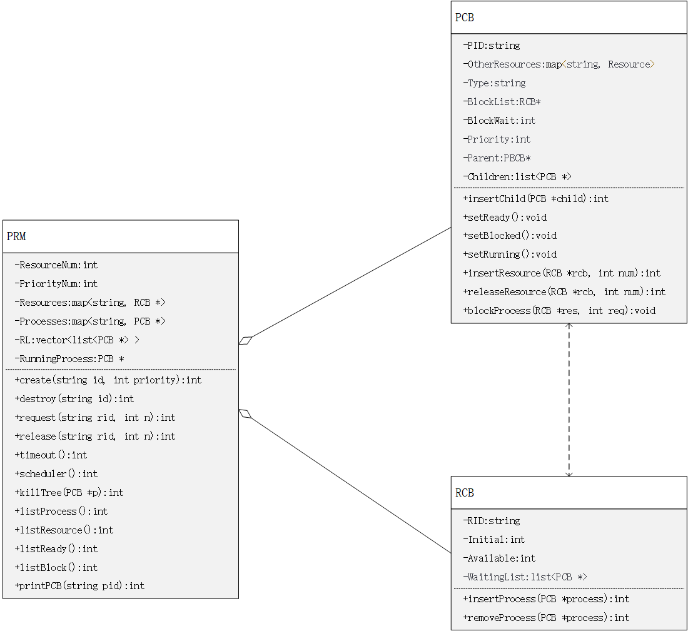

# 进程与资源管理器设计

### 1.TestShell 命令

##### 1.1 进程与资源控制命令

​	初始化：-init [ < resource num> < priority num> ] 

​	进程与资源管理器的资源数目和优先级数目可以由用户输入确定，默认为4和3**（新增）**

​	创建进程：-cr <name> <priority>

​	撤销进程：-de <name>

​	请求资源：-req <resource name> <# of units> 

​	释放资源：-rel <resource name> <# of units>

​	超时：-to

​	退出：-exit **（新增）**

##### 1.2 查看进程状态和资源状态的命令

​	打印就绪队列的所有进程：-list ready

​	打印资源阻塞队列的所有进程：-list block

​	打印管理的所有资源：-list res

​	打印管理是所有进程：-lisy pro **（新增）**

​	打印程序控制块：-pr <name>

### 2.进程和资源管理器设计

​	

### 3.项目组织

​	项目采用CLion开发环境，使用cmake进行项目管理，使用git进行版本控制。

​	注意，可执行文件在cmake-build-debug目录下！

### 4.测试

##### 4.1 样例1

```
init
Init process is running
cr x 1
Process x is running.  
cr p 1
Process x is running.  
cr q 1
Process x is running.  
cr r 1
Process x is running.  
list ready

======Ready List====== 
2:
1:x p q r
0:init

to
Process x is ready.Process p is running.
req R2 1
Process p request 1 R2
to
Process p is ready.Process q is running.
req R3 3
Process q request 3 R3
to
Process q is ready.Process r is running.
req R4 3
Process r request 3 R4
list res

======Resource List======
RID Initial Available
R1    1       1
R2    2       1
R3    3       0
R4    4       1

to
Process r is ready.Process x is running.
to
Process x is ready.Process p is running.
req R3 1
Process p is blocked.Process q is running.
req R4 2
Process q is blocked.Process r is running.
req R2 2
Process r is blocked.Process x is running.
list block

======Block List======
R1
R2 r
R3 p
R4 q

to
Process x is ready.Process x is running.
de q
Release R3.Wake up process p.Process x is running.
to
Process x is ready.Process p is running.
to
Process p is ready.Process x is running.
```

##### 4.2 样例2

```
init
Init process is running
cr A 1
Process A is running.
cr B 1
Process A is running.
cr C 1
Process A is running.
to
Process A is ready.Process B is running.
cr D 1
Process B is running.
cr E 1
Process B is running.
to
Process B is ready.Process C is running.
cr F 1
Process C is running.
req R1 1
Process C request 1 R1
req R2 2
Process C request 2 R2
to
Process C is ready.Process A is running.
req R2 1
Process A is blocked.Process D is running.
req R3 3
Process D request 3 R3
to
Process D is ready.Process E is running.
req R4 4
Process E request 4 R4
to
Process E is ready.Process B is running.
req R3 2
Process B is blocked.Process F is running.
to
Process F is ready.Process C is running.
rel R2 1
Process C is running.
to
Process C is ready.Process D is running.
rel R3 2
Process D is running.
to
Process D is ready.Process E is running.
to
Process E is ready.Process F is running.
req R3 3
Process F is blocked.Process A is running.
de B
Release R3.Release R4.Release R3.Wake up process F.Process A is running.
to
Process A is ready.Process C is running.
to
Process C is ready.Process F is running.
to
Process F is ready.Process A is running.
```

##### 4.3 样例3

```
init 6 4
//管理器启动，用户指定了有6种资源(R1~R6)，4个进程的优先级（0~3）
Init process is running
cr A 1
//创建进程A，由于进程A优先级更高，抢占init进程
Process A is running.
cr B 1
//创建进程B，由于进程B的优先级没有比A高，所以没有抢占进程A
Process A is running.
cr C 1
//创建进程C，由于进程C的优先级没有比A高，所以没有抢占进程A
Process A is running.
list ready

//就绪队列符合上述进程创建的结果
======Ready List======
3:
2:
1:A B C
0:init

req R1 1
//当前运行的进程是A，所以是进程A请求1个资源R1
Process A request 1 R1
req R2 1
//当前运行的进程是A，所以是进程A请求1个资源R2
Process A request 1 R2
to
//当前就绪队列为：A B C ，A超时后，轮转到B运行
Process A is ready.Process B is running.
req R3 2
//当前运行的进程是B，所以是进程B请求2个资源R3
Process B request 2 R3
to
//当前就绪队列为：B C A ，B超时后，轮转到C运行
Process B is ready.Process C is running.
req R4 3
//当前运行的进程是C，所以是进程C请求3个资源R4
Process C request 3 R4
list res

//资源列表符合上述资源请求情况
======Resource List======
RID Initial Available
R1    1       0
R2    2       1
R3    3       1
R4    4       1
R5    5       5
R6    6       6

cr D 2
//创建进程D，由于进程D优先级更高，抢占进程C
Process D is running.
cr E 3
//创建进程E，由于进程E优先级更高，抢占进程D
Process E is running.
list ready

//就绪队列符合上述进程创建的结果
======Ready List======
3:E
2:D
1:A B C

req R1 1
//当前运行的进程是E，根据资源列表R1的可用资源为0，所以进程E阻塞；
//当前就绪队列(优先级2)为：D ，E超时后，轮转到D运行
Process E is blocked.Process D is running.
req R5 5
//当前运行的进程是D，所以是进程D请求5个资源R2
Process D request 5 R5
req R1 1
//当前运行的进程是D，根据资源列表R1的可用资源为0，所以进程D阻塞；
//当前就绪队列(优先级1)为：A B C  ，D超时后，轮转到A运行
Process D is blocked.Process A is running.
list res

//资源列表符合上述资源请求情况
======Resource List======
RID Initial Available
R1    1       0
R2    2       1
R3    3       1
R4    4       1
R5    5       0
R6    6       6

req R5 5
//当前运行的进程是A，根据资源列表R5的可用资源为0，所以进程A阻塞；
//当前就绪队列(优先级1)为：A B C  ，A超时后，轮转到B运行
Process A is blocked.Process B is running.
pr C

//进程C的PCB，有子进程D
======Process Information======
PID : C
Status : ready
Priority : 1
Parent : A
Children : D
Resource : R4-3 

pr D

//进程D的PCB，有子进程E
======Process Information======
PID : D
Status : blocked
BlcokList : R1 wait 1
Priority : 2
Parent : C
Children : E
Resource : R5-5

pr E

//进程E的PCB
======Process Information======
PID : E
Status : blocked
BlcokList : R1 wait 1
Priority : 3
Parent : D
Children :
Resource :

de C
//撤销进程C，递归撤销子进程D、E
//进程撤销释放资源R5、R4，唤醒进程A
Release R5.Wake up process A.Release R4.Process B is running.
list ready

//就绪队列符合上述进程唤醒的结果
======Ready List======
3:
2:
1:B A
0:init

list res

//资源列表符合上述资源释放请求情况
======Resource List======
RID Initial Available
R1    1       0
R2    2       1
R3    3       1
R4    4       4
R5    5       0
R6    6       6
```

